# 🏋️ Espaço Fit – Projeto Integrador SENAC

### 👨‍💻 Equipe de Desenvolvimento – TECH STATUS


O sistema **Espaço Fit** foi desenvolvido pela equipe **TECH STATUS**, formada por alunos do SENAC, como parte do **Projeto Integrador**, com atuação colaborativa no desenvolvimento, modelagem do banco de dados, interface e documentação do sistema.

**Integrantes da equipe:**
- JORGE COSTA  
- TAINÁ RAMOS  
- ARJUNA SATO  


# 📌 Introdução

O **Espaço Fit** é um **Projeto Integrador desenvolvido no SENAC**, com o objetivo de aplicar, de forma prática, os conhecimentos adquiridos ao longo do curso nas áreas de **programação, banco de dados, segurança da informação e experiência do usuário**.

O sistema foi idealizado para atender academias de pequeno e médio porte, oferecendo uma **plataforma completa de gestão**, automatizando processos administrativos, financeiros e operacionais, além de melhorar a comunicação entre academia e alunos.

---

## 🎯 Objetivo do Projeto

Desenvolver um **software de gestão para academias**, capaz de centralizar informações, reduzir erros manuais e facilitar o controle do negócio.

### Objetivos específicos:

- Automatizar o cadastro de alunos, personais e planos;
- Controlar matrícula, status e acesso dos alunos;
- Gerenciar modalidades, horários e avaliações físicas;
- Realizar controle financeiro e de caixa;
- Garantir segurança no armazenamento de senhas;
- Facilitar a comunicação entre aluno e academia;
- Permitir consultas gerenciais para tomada de decisão;
- Possibilitar integração futura com site e vendas online.

---

## 👥 Público-Alvo

- **Gestores e proprietários de academias**, que precisam de organização e controle do negócio;
- **Alunos**, que buscam praticidade, acesso rápido às informações e serviços personalizados;
- **Personais**, que necessitam acompanhar alunos, avaliações e modalidades.

---

## 🧠 Descrição Geral do Sistema

O sistema **Espaço Fit** funciona como uma plataforma integrada onde:

- O **administrador** gerencia alunos, planos, modalidades, pagamentos e relatórios;
- O **aluno** possui vínculo com planos, modalidades, horários e avaliações físicas;
- O **personal** acompanha alunos e realiza avaliações físicas;
- O **sistema financeiro** registra vendas, pagamentos e itens vendidos.

---

## 🏗️ Arquitetura do Sistema

O projeto foi desenvolvido seguindo uma arquitetura simples e eficiente:

### 🔹 Backend / Desktop
- Node JS(Node Javascript)
- Linguagem **JavaScript**
- Conexão direta com o banco de dados MySQL
- Bibliotecas: <br>
        * Express -> Servidor <br>
        * MySQL2 -> Banco de dados <br>
        * BCrypt -> Criptografia da Senha <br>
        * JWT -> Json Web Token <br>
        * DotEnv -> Configurar as Variáveis de Ambiente <br>
        * Morgan -> Gerar logos de requisição <br>
        * Helmet -> Segurança dos cabeçalhos <br>
        * CORS -> Permitir o acesso de protocolos div
 
### 🔹 Banco de Dados
- **MySQL / MariaDB**
- Modelagem relacional com integridade referencial
- Uso de chaves primárias e estrangeiras
 
### 🔹 Frontend (Site Institucional)
- **HTML5**
- **CSS3**
- **JavaScript**
- Interface gráfica utilizando **PyQt5(Qt para python)**
- Linguagem **Python**
- Bibliotecas: <br>
        * PyQt5 -> Interface Gráfica (GUI) <br>
        * PyMySQL/MySQL-Connector -> Conexão com Banco de Dados <br>
        * BCrypt -> Criptografia da Senha <br>
        * PyInstaller -> Compilação para executável (.exe) <br>
        * QtWidgets -> Componentes de Interface (Botões, Janelas, Layouts) <br>
        * QtCore -> Núcleo (Sinais, Slots, Timers e Eventos) <br>
        * QtGui -> Recursos Gráficos (Ícones, Cores, Fontes) <br>
        * Sys -> Manipulação de parâmetros do sistema e encerramento <br>
        * OS -> Interação com o Sistema Operacional (Pastas e Arquivos)
- Preparado para integração com o sistema principal
 
---
## 🛠️ Tecnologias Utilizadas

### Backend / Desktop

- MySQL / MariaDB
- PyMySQL / mysql-connector
- bcrypt (hash de senhas)

### Frontend
- HTML5
- Python
- PyQt5
- CSS3
- JavaScript

---
### Estrutura do Projeto(BackEnd):
    Projeto
        |_ node_module
        |_ .gitignore
        |_ .dotenv
        |_ package.json
        |_ src
            |_ index.js
            |_ config
            |    |_ config.js
            |_ database
            |    |_ conexao.js
            |_ models
            |    |_ Cliente.js
            |    |_ Produto.js
            |    |_ Categoria.js
            |    |_ Pedido.js
            |    |_ Detalhes_Pedido.js
            |    |_ Pagamento.js
            |_ controllers
            |    |_ cliente_controller.js
            |    |_ produto_controller.js
            |    |_ categoria_controller.js
            |    |_ pedido_controller.js
            |    |_ detalhes_pedido_controller.js
            |    |_ pagamento_controller.js
            |_routes
            |    |_ route.js
            |_ middleware
            |    |_ verificar_token.js

### Estrutura do Projeto (FrontEnd):
    Projeto
        |_css
        |   |_detalhes.css
        |   |_login.css
        |   |_perfil_talvez.css
        |   |_plano.css
        |   |_registro_teste.css
        |   |_resgistro.css
        |   |_Saiba_Mais1.css
        |   |_Saiba_Mais2.css
        |   |_Saiba_Mais3.css
        |   |_style.css
        |_img
        |   |_Loja
        |   |_Pagina
        |_js
        |   |_Login.js
        |   |_plano.js
        |   |_Registro_teste.js
        |   |_Registro.js
        |   |_saiba_mais.js
        |   |_script.js
        |_Detalhes.html
        |_index.html
        |_Login.html
        |_Perfil_tavez.html
        |_Plano.html
        |_registro.html
        |_registro_teste.html
        |_saiba_mais1.html
        |_saiba_mais2.html
        |_saiba_mais3.html

### Estrutura do Projeto (PyQt5):
    Projeto
        |_.venv
        |_Iclude
        |_Lib
        |_scripts
        |_cadastro
        |   |_ __init__.py
        |   |_cadastro_aluno.py
        |   |_cadastro_avaliacao.py
        |   |_cadastro_horario.py
        |   |_cadastro_modalidade_aluno.py
        |   |_cadastro_modalidade_personal.py
        |   |_cadastro_modalidade.py
        |   |_cadastro_pagamento_modalidade.py
        |   |_cadastro_pagamento.py
        |   |_cadastro_personal.py
        |   |_cadastro_plano.py
        |   |_cadastro_status.py
        |_consulta
        |   |_ __init__.py
        |   |_consultar_aluno.py
        |   |_consultar_avaliacao.py
        |   |_consultar_horario.py
        |   |_consultar_itens_venda.py
        |   |_consultar_modalidade_aluno.py
        |   |_consultar_modalidade_pessoal.py
        |   |_consultar_modalidade.py
        |   |_consultar_pagamento.py
        |   |_consultar_personal.py
        |   |_consultar_plano.py
        |   |_consultar_status.py
        |   |_consultar_venda.py
        |_senha
        |   |_recuperar_senha_aluno.py
        |   |_recuperar_senha.py
        |   |_recuperar_senha2.py
        |_telas_principais
        |   |_caixa_uai.py
        |   |_matriculado.py
        |   |_tela_gestao.py
        |_cadastro_sistema
        |   |_cadastro_produto.py
        |   |_cadastro_usuario.py
        |   |_consultar_produto.py
        |_adm.py
        |_login_atendimento.py
        |_login_cadastro_consulta.py
        |_login_financeiro.py


## 🔐 Segurança da Informação

O sistema implementa boas práticas de segurança, como:

- Armazenamento de senhas utilizando **hash bcrypt**, evitando senhas em texto puro;
- Uso de autenticação por usuário e senha;
- Restrições de acesso baseadas em perfil;
- Integridade referencial no banco de dados;
- Redução de riscos de inconsistência de dados.

## 🌐 Frontend – Estrutura do Site

O frontend do projeto foi desenvolvido utilizando **HTML estruturado em seções**, com apoio de **CSS para estilização visual** e **JavaScript para interações básicas**.

A navegação principal é feita por **âncoras**, permitindo acesso rápido às seções da página sem recarregamento.


## 🌐 Tela Inicial do Site

Página inicial do site institucional da academia.

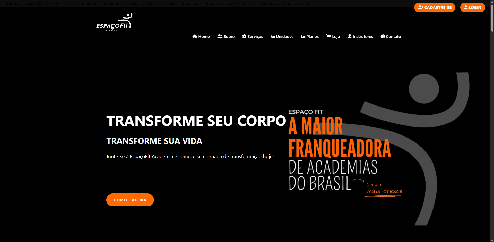


---

### 📄 Página Principal (academia.html)

A página inicial concentra as principais informações da academia, sendo dividida em seções como *Home*, *Sobre*, *Serviços*, *Unidades*, *Planos*, *Loja*, *Instrutores* e *Contato*.


### Exemplo do menu de navegação:

```html
<nav>
  <ul>
    <li><a href="#home">Home</a></li>
    <li><a href="#sobre">Sobre</a></li>
    <li><a href="#servicos">Serviços</a></li>
    <li><a href="#planos">Planos</a></li>
  </ul>
</nav>
```


---


### 🔐 Página de Login
A página de login é composta por um formulário simples para autenticação do usuário.

```html
<form onsubmit="return false">
  <input type="email" id="email" placeholder="seu@email.com">
  <input type="password" id="senha" placeholder="Digite sua senha">
  <input type="submit" value="Entrar">
</form>
```


## 🌐 Tela de Login

Tela de login do aluno para acessar os produtos e serviços.

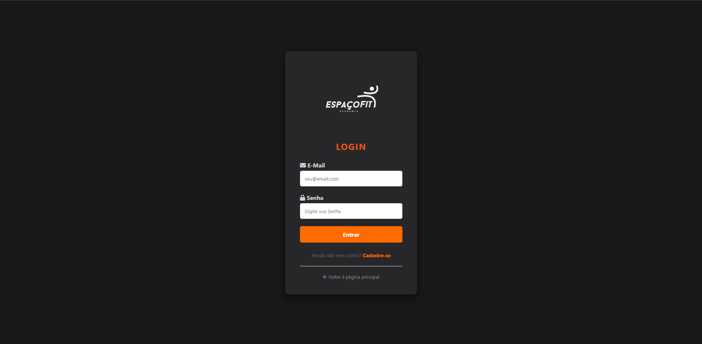


O uso do atributo onsubmit="return false" evita o recarregamento da página, permitindo que a validação seja realizada via JavaScript.


## 🌐 Tela das unidades

Tela das unidades e filiais da marca.

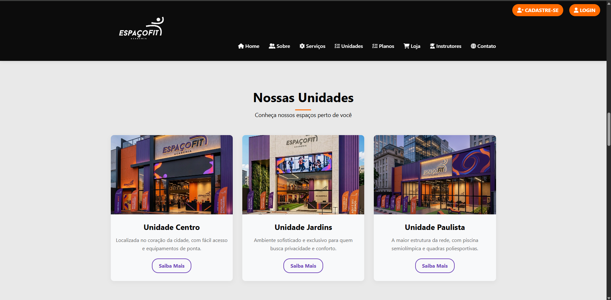


### 📝 Página de Registro (Cadastro de Aluno)
A página de cadastro realiza o registro completo do aluno, incluindo dados pessoais, contato, plano e objetivo.
Principais informações coletadas:

Nome completo;
E-mail;
Senha;
CPF e RG;
Endereço;
Telefone;
Sexo;
Data de nascimento;
Plano escolhido.

O formulário é organizado em grid, melhorando a legibilidade e a experiência do usuário.


## 🌐 Página de Registro (Cadastro de Aluno)

Página de cadastro do aluno.

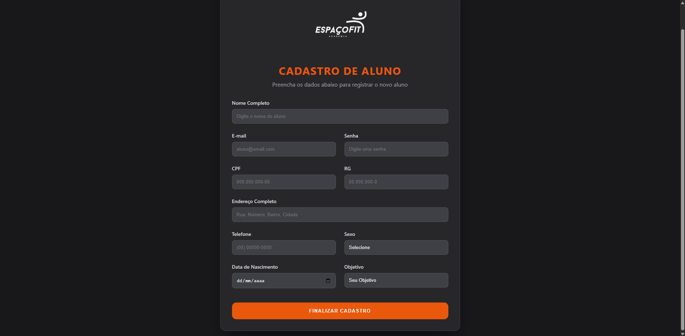


### 📝 Página de Registro (Cadastro de Aluno)
A página de cadastro realiza o registro completo do aluno, incluindo dados pessoais, contato, plano e objetivo.
Principais informações coletadas:

Nome completo;
E-mail;
Senha;
CPF e RG;
Endereço;
Telefone;
Sexo;
Data de nascimento;
Plano escolhido.

O formulário é organizado em grid, melhorando a legibilidade e a experiência do usuário.

### 👤 Página de Perfil do Aluno
A página de perfil apresenta uma estrutura semelhante à página principal, porém adaptada para usuários autenticados, com opção de sair do sistema e acesso às informações pessoais.

## 🌐 Back end – Estrutura do Softwere de gerenciamento para uso interno 

O sistema apresenta uma interface intuitiva e de fácil navegação, oferecendo uma experiência eficiente para usuários que buscam um software profissional, objetivo e confiável. As funcionalidades disponíveis visam otimizar os processos de gestão de academias, contribuindo para maior produtividade e organização administrativa.


## 🔐 Tela Inicial do Sistema (Backend)

Esta tela representa a interface inicial do sistema administrativo.

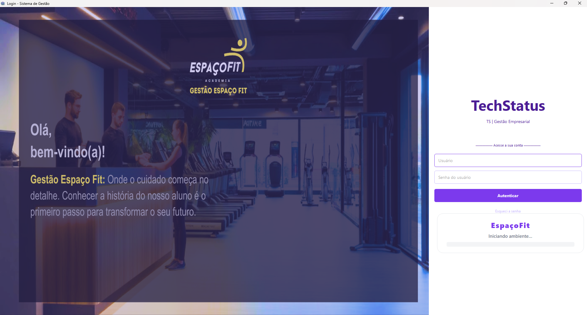


## ⚙️ Backend – Sistema de Gestão Interna (PyQt5)

O backend do **Espaço Fit** foi desenvolvido em **Python**, utilizando a biblioteca **PyQt5** para a criação de interfaces gráficas desktop e **MySQL** como banco de dados relacional.

O sistema foi projetado de forma **modular**, onde cada funcionalidade (cadastro, consulta, atendimento e administração) é organizada em telas independentes, mantendo o código limpo, reutilizável e escalável.

---

## 🧭 Tela Principal de Gestão

A **Tela Principal** atua como o núcleo do sistema administrativo, concentrando os módulos de **gestão operacional**, **configuração estrutural** e **acesso à central de consultas**.

### Objetivos da Tela Principal:
- Centralizar o acesso aos módulos do sistema;
- Facilitar a navegação entre cadastros, consultas e configurações;
- Manter a aplicação organizada e intuitiva.

### Criação da Janela Principal

```python
class TelaPrincipal2(QMainWindow):
    def __init__(self):
        super().__init__()
        self.setWindowTitle("Sistema de Gestão")
        self.setWindowState(Qt.WindowMaximized)
        self.janelas_abertas = []

```        

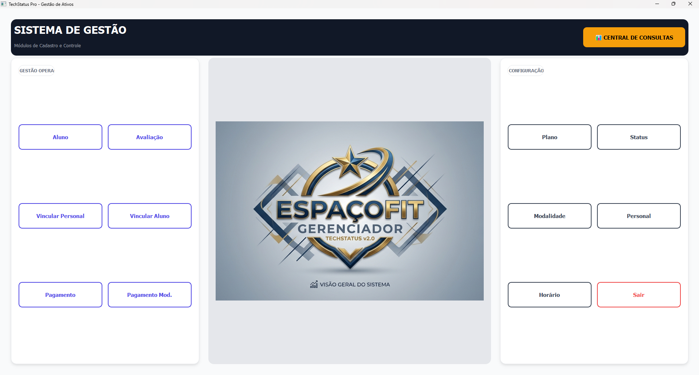


### Explicação:

A aplicação herda de QMainWindow, ideal para sistemas desktop completos;
A janela é aberta em modo maximizado para melhor aproveitamento do espaço;
A lista janelas_abertas mantém referências às telas abertas, evitando que sejam fechadas pela coleta de lixo do Python.


## Estrutura Modular dos Botões

```python
    
self.botoes_esq = [
    ("Aluno", cadastro_aluno),
    ("Avaliação", cadastro_avaliacao),
    ("Vincular Personal", cadastro_modalidade_personal),
    ("Vincular Aluno", cadastro_modalidade_aluno),
    ("Pagamento", cadastro_pagamento),
    ("Pagamento Mod.", cadastro_pagamento_modalidade)
]

```

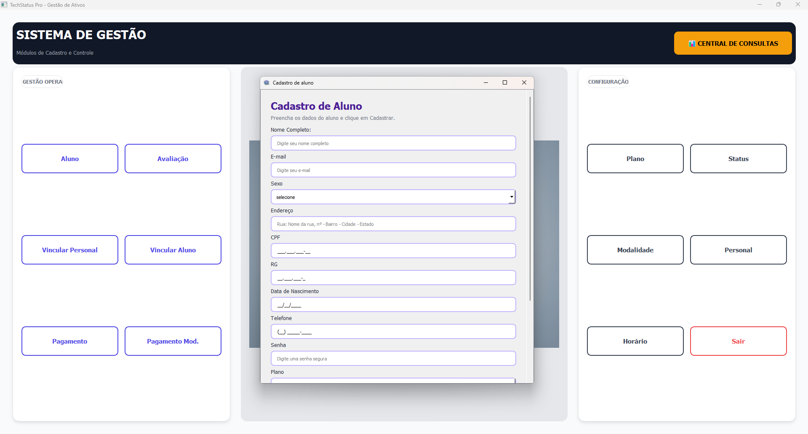

### Explicação:

Cada botão é associado diretamente à classe responsável pela tela correspondente;
Esse padrão reduz código repetido;
Facilita a manutenção e inclusão de novos módulos no futuro.


## Abertura Dinâmica de Telas
```python
def abrir_tela(self, classe):
    janela = classe()
    janela.show()
    self.janelas_abertas.append(janela)
```

### Explicação:

Permite abrir qualquer tela do sistema a partir de sua classe;
Evita acoplamento entre telas;
Garante que múltiplas janelas possam ser abertas simultaneamente.

# 📊 Central de Consultas e Relatórios
A Central de Consultas concentra todas as telas de pesquisa e relatórios do sistema, permitindo análises rápidas e organização das informações cadastradas.

## Objetivos da Central de Consultas:

Organização das consultas por tipo de entidade;
Acesso rápido a dados gerenciais;
Visualização clara e funcional.

```python
class TelaConsultas(QMainWindow):
    def __init__(self):
        super().__init__()
        self.setWindowTitle("Central de Inteligência - Consultas")
        self.setWindowState(Qt.WindowMaximized)

```

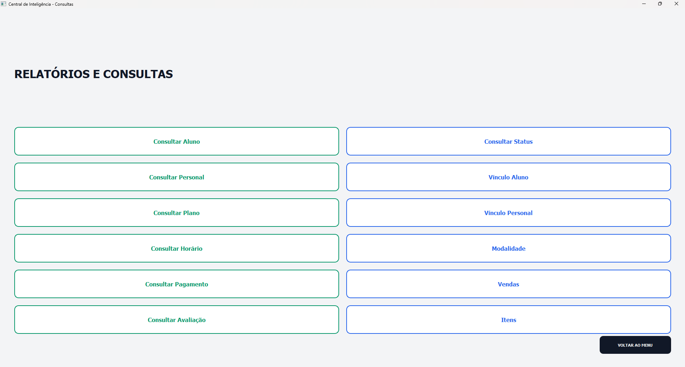

### Explicação:

Tela exclusiva para consultas e relatórios;
Interface estruturada com grid de botões;
Cada botão direciona para uma consulta específica.


# 📩 Backend da Central de Atendimento e Mensagens

O sistema possui uma Central de Atendimento, responsável pela leitura, organização e gerenciamento das mensagens enviadas pelos clientes através do site institucional.

### Conexão com o Banco de Dados
```python
def _conectar(self):
    return pymysql.connect(
        host="127.0.0.1",
        user="root",
        password="",
        database="Academ
```
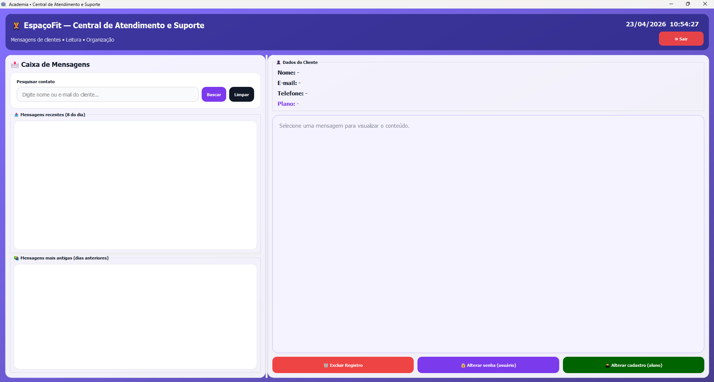

### Explicação:

Centraliza a conexão com o MySQL;
Garante padronização e segurança;
Facilita futuras alterações de credenciais.


### Carregamento Automático de Mensagens

```python
self.timer_novas = QTimer(self)
self.timer_novas.setInterval(5000)
self.timer_novas.timeout.connect(self.checar_novas_mensagens)
self.timer_novas.start()
```
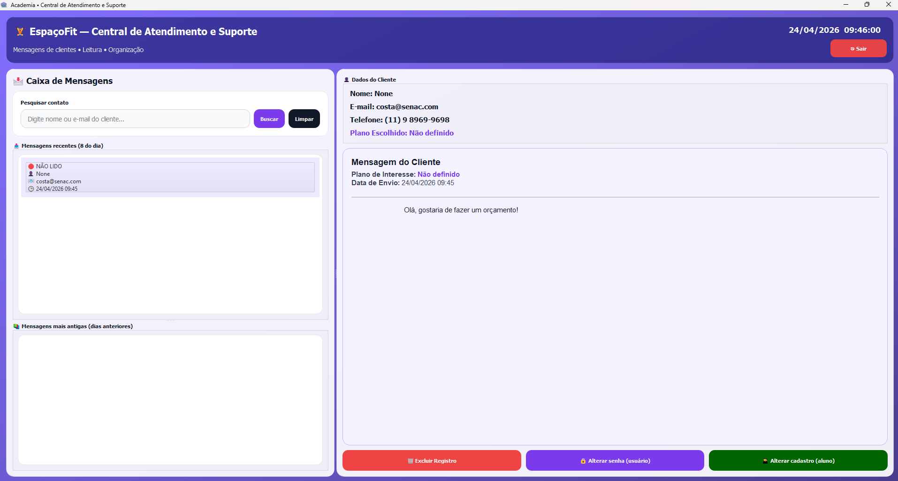


### Explicação:

Verifica novas mensagens automaticamente a cada 5 segundos;
Mantém o sistema atualizado sem intervenção do usuário;
Aumenta a eficiência do atendimento.


### Separação de Mensagens Recentes e Antigas

```python
SELECT id_contato, nome_completo, email,
       DATE_FORMAT(data_recebimento,'%d/%m/%Y %H:%i'),
       status_leitura
FROM contato
WHERE DATE(data_recebimento) = CURDATE()
ORDER BY data_recebimento DESC
LIMIT 8
```
### Explicação:

Mensagens do dia ficam em destaque;
Mensagens antigas são organizadas separadamente;
Melhora a produtividade e leitura das mensagens.

### Visualização Detalhada da Mensagem

```python
self.txt_detalhes.setHtml(html_msg)
```

### Explicação:

O conteúdo da mensagem é estruturado em HTML;
Exibe dados do cliente, plano de interesse e mensagem;
Mantém visual profissional e organizado.

### Marcação Automática como Lido

```python
cursor.execute(
    "UPDATE contato SET status_leitura = 'lido' WHERE id_contato = %s",
    (id_contato,)
)

```

### Explicação:


Evita leitura duplicada;
Atualiza automaticamente o status no banco;
Mantém controle do fluxo de atendimento.


# 🔐 Tela Administrativa (Usuários e Produtos)
A Tela Administrativa é responsável por funcionalidades internas como:

Cadastro de usuários;
Cadastro e consulta de produtos;
Acesso restrito a perfis administrativos.

```python
class AppTechStatus(QWidget):
    def __init__(self):
        super().__init__()
        self.setWindowTitle("Menu Principal - TechStatus")
```

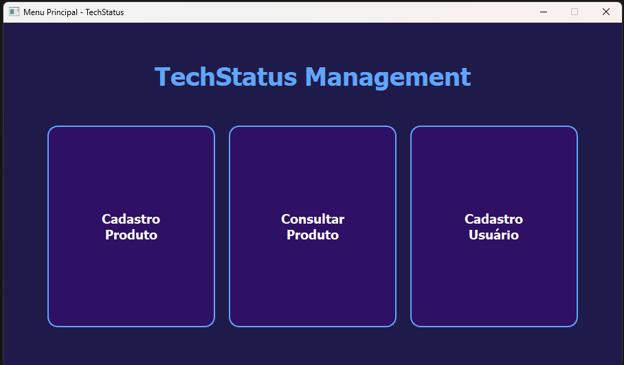

### Explicação:

Interface simples e objetiva;
Organização visual baseada em botões de acesso rápido;
Facilita o controle administrativo do sistema.

# 


# ✅ Benefícios da Arquitetura Backend

Código modular e organizado;
Fácil manutenção e expansão;
Separação clara de responsabilidades;
Integração eficiente entre interface gráfica e banco de dados;
Experiência fluida para operadores e administradores.


# 🗄️ Banco de Dados – Sistema Espaço Fit (MySQL)

O banco de dados do **Espaço Fit** foi desenvolvido utilizando **MySQL**, com o objetivo de oferecer uma estrutura **segura, organizada e relacional**, capaz de sustentar todas as operações do sistema, desde cadastros básicos até controle financeiro, vendas, avaliações físicas e comunicação com clientes.

A modelagem foi pensada para garantir:
- Integridade referencial;
- Consistência dos dados;
- Facilidade de manutenção e expansão;
- Integração eficiente com o backend em Python.

---

### 📊 Visão Geral do Banco de Dados

O banco de dados denominado **`Academia`** centraliza todas as informações do sistema, sendo dividido em tabelas que representam entidades fundamentais como alunos, planos, profissionais, modalidades, pagamentos, produtos e mensagens.

### Diagrama Entidade-Relacionamento (DER) ou visão geral do banco  

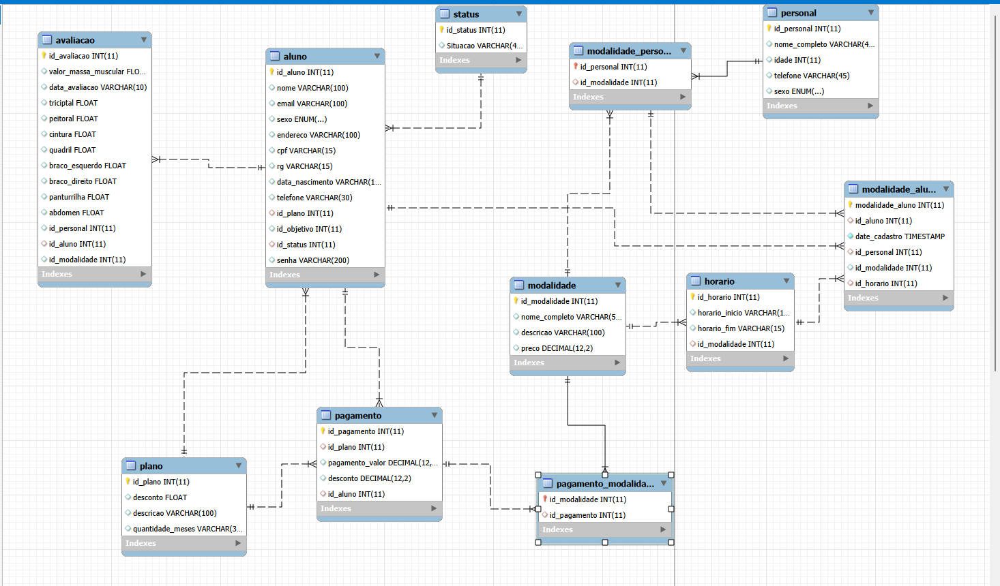


## 🧩 Principais Tabelas e Responsabilidades
A seguir estão descritas as principais tabelas do banco e suas funções dentro do sistema:

- usuario – Armazena os usuários administrativos do sistema;
- aluno – Dados pessoais dos alunos e vínculo com plano e status;
- status – Define a situação do aluno (ativo, inativo, etc.);
- plano – Planos comerciais disponíveis na academia;
- modalidade – Atividades e serviços oferecidos;
- personal – Profissionais da academia;
- horario – Horários associados às modalidades;
- modalidade_aluno – Vínculo entre aluno, modalidade, personal e horário;
- avaliacao – Avaliações físicas realizadas nos alunos;
- pagamento – Registro de pagamentos de planos;
- pagamento_modalidade – Pagamentos vinculados a modalidades específicas;
- venda – Controle de vendas de produtos;
- itens_venda – Itens vendidos em cada venda;
- categoria – Classificação dos produtos;
- produto – Produtos comercializados na loja;
- contato – Mensagens enviadas pelos clientes pelo site.


### 🔑 Chaves Primárias
Todas as tabelas utilizam chaves primárias auto incrementáveis, garantindo a identificação única de cada registro no banco de dados.
Exemplos:

- id_aluno identifica exclusivamente cada aluno;
- id_plano identifica cada plano disponível;
- id_venda identifica cada venda realizada;
- id_contato identifica cada mensagem recebida.

Esse padrão facilita consultas, relacionamentos e manutenção do banco.

### 🔗 Relacionamentos e Chaves Estrangeiras
O banco utiliza foreign keys para garantir a integridade referencial entre as tabelas, impedindo registros inconsistentes.
Exemplos de relacionamentos importantes:

- aluno.id_status → status.id_status
- aluno.id_plano → plano.id_plano
- modalidade_aluno.id_aluno → aluno.id_aluno
- avaliacao.id_aluno → aluno.id_aluno
- pagamento.id_aluno → aluno.id_aluno
- pagamento.id_plano → plano.id_plano
- horario.id_modalidade → modalidade.id_modalidade
- itens_venda.id_venda → venda.id_venda


### 🧾 Exemplo de Estrutura de Tabela
A tabela aluno é uma das principais do sistema, centralizando dados pessoais e relacionamentos com outras entidades.
```
CREATE TABLE aluno (
  id_aluno INT AUTO_INCREMENT PRIMARY KEY,
  nome VARCHAR(100),
  email VARCHAR(100),
  sexo ENUM('Masculino','Feminino'),
  endereco VARCHAR(100),
  cpf VARCHAR(15),
  rg VARCHAR(15),
  data_nascimento VARCHAR(11),
  telefone VARCHAR(30),
  id_plano INT,
  id_objetivo INT,
  id_status INT,
  senha VARCHAR(200)
);
```

### Explicação:

Armazena informações cadastrais do aluno;
Relaciona-se com plano e status;
Permite autenticação por senha;
Serve como base para pagamentos, avaliações e vínculos com modalidades.


## 💰 Controle Financeiro e Vendas
O sistema possui um módulo financeiro separado, responsável pelo controle de pagamentos e vendas de produtos.

pagamento: registra valores pagos pelos alunos;
venda e itens_venda: controlam vendas realizadas na loja;
produto: gerencia produtos com fotos armazenadas no banco;
categoria: organiza os produtos por tipo.

Essa estrutura permite relatórios financeiros detalhados e escalabilidade futura.


## ✅ Considerações Finais do Banco de Dados
O banco de dados do Espaço Fit foi projetado para oferecer uma base sólida, segura e bem estruturada, atendendo todas as necessidades funcionais do sistema.
A utilização correta de:

Chaves primárias;
Chaves estrangeiras;
Relacionamentos consistentes;

garante integridade dos dados, facilidade de manutenção e alto potencial de crescimento da aplicação.
Essa modelagem permite que o sistema evolua futuramente para ambientes web ou mobile, mantendo a consistência dos dados.


# ✅ Considerações Finais do Projeto Integrador – SENAC
O projeto Espaço Fit consolida os conhecimentos adquiridos nas áreas de programação, banco de dados, desenvolvimento frontend e modelagem de sistemas, resultando em uma aplicação organizada, funcional e escalável.
Trata-se de uma solução com potencial de evolução para aplicações web completas ou mobile, atendendo às demandas reais do mercado fitness.
#  📚 Projeto Integrador – SENAC


### 👨‍💻 Equipe de Desenvolvimento – TECH STATUS


---


<div align="center" style="display: flex; justify-content: center; gap: 40px;">

  <div style="text-align: center;">
    
    <br>
    <strong>JORGE COSTA</strong><br>
    <span style="font-size: 12px;">
      Backend • PyQt5 • Banco de Dados • Documentação 
    </span>
  </div>

  <div style="text-align: center;">
    
    <br>
    <strong>TAINÁ RAMOS</strong><br>
    <span style="font-size: 12px;">
      Frontend • HTML • CSS • JavaScript • UX/UI
    </span>
  </div>

  <div style="text-align: center;">
    
    <br>
    <strong>ARJUNA SATO</strong><br>
    <span style="font-size: 12px;">
      Banco de Dados • Modelagem • SQL
    </span>
  </div>

</div>


</div>


<br><br>

<div align="center">
  
  <br>
  <em>Equipe TECH STATUS – Projeto Integrador SENAC</em>
</div>


### 👨‍💻 Equipe de Desenvolvimento – TECH STATUS

O projeto **Espaço Fit** foi desenvolvido pela equipe **TECH STATUS**, formada por alunos do SENAC, que atuaram de forma colaborativa em todas as etapas do projeto, desde a concepção da ideia até o desenvolvimento, testes, documentação e entrega final.  
Cada integrante teve papel fundamental para o sucesso do sistema, contribuindo com suas competências técnicas e criativas.

---

#### 👨‍💻 JORGE COSTA  
**Cargo:** Líder de Projeto e Desenvolvedor Backend

Atuou como **líder do projeto**, sendo responsável pelo **aprimoramento do sistema de software da academia**, com foco na **usabilidade e experiência do usuário**. Trabalhou diretamente na melhoria da **interface do sistema**, adicionando funcionalidades, botões e fluxos de navegação pensados na utilização real do usuário final.

Foi responsável também pela **organização do projeto**, definição do **cronograma de entrega**, distribuição e acompanhamento das atividades da equipe, além da **documentação completa do sistema**. Contribuiu ativamente com ideias sobre como o usuário iria interagir com o software, garantindo um sistema mais intuitivo, funcional e profissional.

**Tecnologias e ferramentas utilizadas:**
- Python  
- PyQt5  
- MySQL  
- Interface Desktop  
- Documentação técnica  
- Gestão e organização do projeto  

---

#### 👩‍🎨 TAINÁ RAMOS  
**Cargo:** Designer e Desenvolvedora Frontend

Foi responsável por todo o **design visual do projeto**, idealizando o conceito da academia **Espaço Fit** desde o início. Desenvolveu o **layout do site institucional**, criou os **logotipos**, imagens, figuras e identidade visual do projeto.

Também foi responsável pela **criação visual de todos os produtos e serviços** que são apresentados na loja da academia, bem como o design das páginas do site, sempre focando na **estética, organização visual e experiência do usuário (UX/UI)**. Sua atuação garantiu um site moderno, atrativo e coerente com a proposta da academia.

**Tecnologias e ferramentas utilizadas:**
- HTML5  
- CSS3  
- JavaScript  
- UX/UI Design  
- Criação de logotipos e identidade visual  
- Design de produtos e serviços  
- Edição e criação de imagens  

---

#### 👨‍💻 ARJUNA SATO  
**Cargo:** Desenvolvedor Backend e Analista de Banco de Dados

Foi responsável pelo **desenvolvimento dos códigos do backend do sistema**, implementando as principais funcionalidades do software e garantindo seu correto funcionamento. Atuou na **criação e modelagem do banco de dados**, definindo tabelas, relacionamentos e integridade referencial.

Realizou a **integração entre o sistema desktop e o site**, implementação de segurança com **bcrypt**, além da correção de erros, testes do sistema e validação das funcionalidades. Também contribuiu com sugestões técnicas e ideias para melhoria do projeto, sendo responsável por assegurar a **estabilidade e funcionamento correto de todo o código**.

**Tecnologias e ferramentas utilizadas:**
- Python  
- PyQt5  
- MySQL / MariaDB  
- HTML  
- Java  
- bcrypt  
- Integração backend ↔ frontend  
- Testes e correções de erros  

---

### 🤝 Trabalho em Equipe

O sucesso do projeto **Espaço Fit** foi resultado da **colaboração entre os integrantes da equipe TECH STATUS**, onde cada membro exerceu papel essencial. A integração entre **desenvolvimento, design, banco de dados, organização e documentação** possibilitou a entrega de um sistema completo, funcional, visualmente atrativo e alinhado aos objetivos do Projeto Integrador do SENAC.
